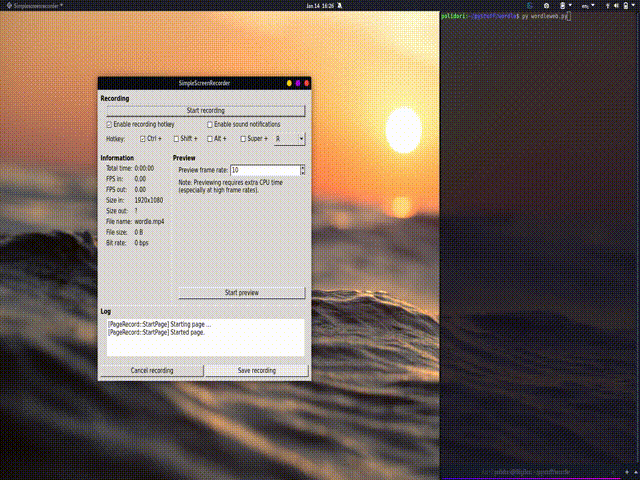

# Wordle_Bot
Python bot created with Selenium that can guess the daily Wordle word correct 96.8% of the time.

Note: this bot has not been updated to work with the new NYT website. The only real issue with that is that the current accuracy is a good bit lower than 97%

</img>

It will log onto the wordle website and enter guesses until it gets it right.

I tried a new algorithm works by guessing the five words: quick, brown, shady, cleft, gimps to see what letters in the alphabet are in the actual word.

Most of the time, the bot is able to figure out all 5 letters in the word at this point. It will take the letters in the order it received them, unscramble them, and add any word it creates with that criteria to a list of possible answers. Words are then removed from the list if they do not meet the following criteria:

a: Their letters do not match the known letters and known locations

b: Their letters match the location of a known letter that has an unknown location

If it does not know all 5 letters, then it will attempt to unscramble and solve for the three or four letters with an (or two) additional letter that is either a copy of a known letter or an unknown letter not in the 5 previously guessed words. (x, z, j, v) 

This method allows me to reduce the possible answers to 1 over 90% of the time and guess the correct answer a total of ~97% of the time (by picking a random value from a list of possible values), which I believe is quite good for an automated bot. It is, however, a lesser percentage than a couple of the other bots out there, but better than most and uses a very different approach than all of the bots I have seen. Feel free to build off my code if you want to make a better algorythm. I know a lot of the bots out there have better algorythms, but I wanted to try this idea and actually input the guesses to the website.

The wordleweb.py program runs selenium and inputs guesses to the website, while the wordletest.py program allows you to test different methods and find the percentage that they can work. Anyone is free to use any of this code because I know there are much better algorythyms than mine.

Also, the OptimalFirstWord file is a side-side project I did to calculate the optimal first word to guess. More details are inside that folder.
